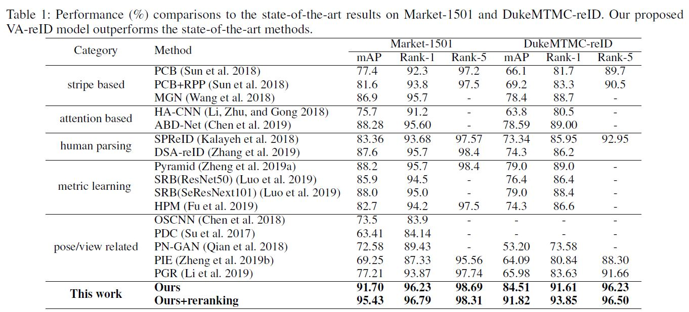

# Viewpoint-Aware Loss with Angular Regularization for Person Re-Identification (AAAI 2020)

Code for AAAI 2020 paper [Viewpoint-Aware Loss with Angular Regularization for Person Re-Identification](https://arxiv.org/abs/1912.01300).


If you find this code useful in your research, please consider citing:
```
@article{zhu2020viewpoint,
  title={Viewpoint-Aware Loss with Angular Regularization for Person Re-Identification},
  author={Zhihui Zhu, Xinyang Jiang, Feng Zheng, Xiaowei Guo, Feiyue Huang, Weishi Zheng, Xing Sun},
  booktitle={AAAI},
  year={2020}
}
```


## Requirements
pytorch>=0.4
torchvision
ignite=0.1.2 (Note: V0.2.0 may result in an error)
yacs


## Training
1. Download the public datasets ( market1501 and DukeMTMC are supported) and use the corresponding dataloader. 
2. Construct viewpoint information. For each image, assign four labels: front, back, right side and left side
The viewpoint meta data forms a dictionary and stores in a pickle file: {'image_name.jpg':(0/1/2/3, )}
3. To use your own dataset re-implement the dataloader in directory "data/datasets".
4. Sample running command under the same directory of this readme file:
    training config is stored in a yaml file, the examples are in configs directory
    sh market_run.sh / sh duke_run.sh

## Model Framework


## Model Performance

